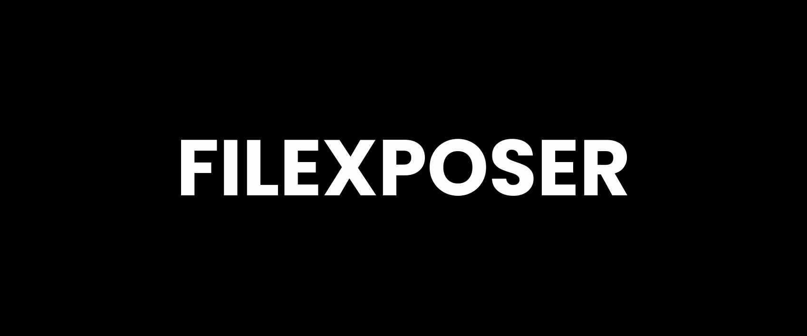

# FILEXPOSER (FXR)

A tool to serve/exposer your files over internet




## Features

- Easy and simple installaion
- Host your files at different continents
- Option to use both http and https protocol
- Secure your files from unauthorize access
- Inspect your server traffic on your browser
- Exposes a particular directory to internet
- Add username and password to your hosted server

  
## Installation

```bash
  git clone https://github.com/prince-gautam200/filexposer.git
  chmod +x install.sh
  start_fxr (To start server)
  stop_fxr  (To stop server)
```
    
## Usage/Examples

```javascript
- This script is mainly made for kali linux 
- Make sure make an accont on ngrok.com (https://dashboard.ngrok.com/signup)
- Other instruction are given by script when you run
- This script can share your intrnet_shard directory present in your root directory.
- To start server usr "start_fxr" command 
- To stop server use "stop_fxr command
- if you forgot your username and password go to /filexposer/creds.txt

```

## Notice 
- This is under development may be it would not work with all distribution. we are working to make this tool work more efficiently as soon as possible.
  
## Authors

- [@prince-gautam200](https://www.github.com/prince-gautam200)
- Written by Prince

  
## License

[MIT License](https://choosealicense.com/licenses/mit/)

  
